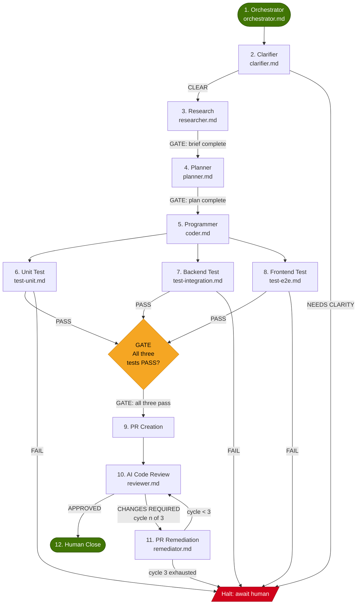

# AGENTS.md

Guidance for AI agents working in this repository.

---

## Project Overview

This is **agentic-ci**: a collection of repo-agnostic, reusable GitHub Actions workflows that wire Claude-powered agentic loops into any CI/CD pipeline. The workflows are built on [claude-code-action](https://github.com/anthropics/claude-code-action) and the `.claude/agents/` convention for per-project behavior overrides.

Consumers copy thin caller workflows from `examples/consumer-workflows/` into their own `.github/workflows/`, then point the `uses:` key at the reusable workflows in this repo. All orchestration logic lives here; consumer files are intentionally minimal (5-20 lines).

**Workflows provided:**

| File | Trigger | Purpose |
|------|---------|---------|
| `pr-review.yml` | PR opened / ready | Copilot + Claude collaborative review cycle |
| `ci-remediate.yml` | CI check fails | Diagnose, fix, and verify failing CI checks |
| `issue-to-pr.yml` | Issue assigned / labeled | Full issue-to-PR autonomous implementation loop |
| `quality-sweep.yml` | Weekly schedule / dispatch | Dead code, unused imports, naming hygiene |
| `pr-describe.yml` | PR opened with empty body | Auto-generate rich PR description from diff |
| `dependabot-review.yml` | Dependabot PR opened | Changelog review and risk assessment |
| `stale-pr-nudge.yml` | Daily schedule | Find and nudge stale PRs with a status comment |

---

## Build Commands

This repo contains no compiled code. There is no build step.

To validate YAML workflow syntax locally:

```bash
# Lint all workflow files with actionlint (install separately)
actionlint .github/workflows/*.yml

# Or validate with the GitHub CLI (requires auth)
gh workflow list
```

To bootstrap a consumer repo from the scaffold:

```bash
./scaffold/bootstrap.sh
```

---

## Test Commands

There is no automated test suite in this repo. Correctness is validated by:

1. Running the example consumer workflows against a real GitHub repository.
2. Reviewing workflow run logs in the GitHub Actions UI.
3. Checking that `examples/consumer-workflows/` files remain syntactically valid YAML.

When modifying a reusable workflow, manually trigger the corresponding consumer workflow against a test repo before merging.

---

## Coding Conventions

### YAML Formatting

- **Indentation**: 2 spaces. Never use tabs.
- **Keys**: lowercase with hyphens (`timeout-minutes`, `fetch-depth`, `cancel-in-progress`).
- **Strings**: use double quotes for all `name:` fields and all values that contain GitHub expression syntax (`${{ ... }}`). Use single quotes or unquoted strings elsewhere.
- **Multiline strings**: use the `|` literal block scalar for `prompt:` fields. Keep the prompt body at one additional indent level.
- **Comments**: place a top-of-file block comment on every reusable workflow explaining its purpose and the `uses:` line a consumer needs. See existing files for the exact format.
- **Blank lines**: separate top-level keys (`on:`, `permissions:`, `jobs:`) with one blank line. Do not add blank lines inside `steps:` blocks unless separating logically distinct groups.

### Naming Patterns

**Workflow files** (reusable, in `.github/workflows/`):
- Lowercase, hyphen-separated, no prefix: `pr-review.yml`, `ci-remediate.yml`.

**Consumer workflow files** (in `examples/consumer-workflows/`):
- Prefixed with `agentic-`: `agentic-pr-review.yml`, `agentic-ci-remediate.yml`.

**Job IDs**: match the workflow filename without extension, hyphen-separated: `pr-review`, `ci-remediate`, `issue-to-pr`.

**Step names**: title case, imperative phrasing: `Checkout repository`, `Run Claude PR Review Orchestrator`, `Find associated PR`.

**Inputs**: lowercase, underscore-separated: `max_fix_rounds`, `auto_approve_patch`, `claude_args`.

**Concurrency groups**: prefixed with `agentic-<workflow-name>-` followed by a unique context key such as PR number or branch name.

**Agent override files** (consumed by workflows at runtime, stored in consumer repos under `.claude/agents/`): lowercase, hyphen-separated, named after the workflow that reads them: `pr-review-orchestrator.md`, `ci-remediate.md`, `quality-sweep.md`, `ship-pipeline.md`.

### Prompt Style in Workflows

- Structure prompts with `##` section headers.
- Use numbered lists for sequential steps and bullet lists for options or rules.
- Always include an `## Agent override` section that instructs Claude to read `.claude/agents/<name>.md` if it exists and to give it precedence over the generic instructions.
- Always include a `## Rules` section at the end of every prompt with hard constraints (never force push, never skip quality gates, etc.).
- Close every generated comment or PR body with an attribution footer: `*<action> by Claude via agentic-ci.*`

---

## Architecture Decisions

### Thin Callers vs. Fat Reusable Workflows

Consumer workflows (the files users copy into their own repos) are intentionally thin: they define triggers, a concurrency group, and a `uses:` reference. They contain no orchestration logic. All logic lives in the reusable workflows in this repo.

This separation means:
- Bug fixes and prompt improvements ship to all consumers by updating this repo at the pinned ref.
- Consumers can customize behavior without touching the shared workflows.
- Diffs on consumer files stay small and reviewable.

**Do not** move orchestration logic (prompt content, step sequences, quality gate detection) into consumer workflows. If a consumer needs different behavior, they should use the `.claude/agents/` override pattern (see below).

### The `.claude/agents/` Override Pattern

Every reusable workflow prompt contains an `## Agent override` section. At runtime, Claude checks the checked-out consumer repo for a named agent file (e.g., `.claude/agents/ci-remediate.md`). If the file exists, its instructions take precedence over the generic prompt for any conflicts.

This means:
- Project-specific coding standards, quality gates, domain vocabulary, and architectural invariants live in the consumer repo, not in this repo.
- This repo never needs to know about consumer-specific conventions.
- Consumers never need to fork or patch the shared workflows.

When adding a new reusable workflow, always include the `## Agent override` section and document which filename Claude will look for.

### Quality Gate Detection

Prompts detect the consumer repo's quality gate at runtime using a fixed priority order:

1. `Makefile` with a `check` target: `make check`
2. `pyproject.toml`: `ruff check . && pytest` (or `ruff check . && ruff format --check . && pytest` for stricter runs)
3. `package.json`: `npm test`
4. `go.mod`: `go vet ./... && go test ./...`
5. `Cargo.toml`: `cargo clippy && cargo test`
6. No gate found: note it and continue.

Do not change this order or add new cases without updating all affected workflow prompts consistently.

### Model Selection Defaults

Default models are chosen per workflow based on typical token usage and task complexity:

- `haiku`: lightweight, high-frequency tasks (`pr-describe`, `stale-pr-nudge`).
- `sonnet`: review, remediation, and implementation tasks (`pr-review`, `ci-remediate`, `issue-to-pr`, `quality-sweep`, `dependabot-review`).
- `opus`: reserved for consumer override via `with: model: opus` when dealing with complex architectural work.

Consumers can override the model via the `model` input on any workflow.

### Permissions

Each reusable workflow declares only the permissions it actually uses. The current grants per workflow:

| Workflow | `contents` | `pull-requests` | `issues` | `checks` | `actions` |
|---------|-----------|----------------|---------|---------|---------|
| pr-review | write | write | write | - | read |
| ci-remediate | write | write | write | read | read |
| issue-to-pr | write | write | write | - | read |
| quality-sweep | write | write | - | - | - |
| pr-describe | read | write | - | - | - |
| dependabot-review | read | write | - | - | - |
| stale-pr-nudge | read | write | - | read | read |

Do not add `write` to `contents` or `pull-requests` unless the workflow actually pushes commits or edits PRs.

### Concurrency Groups

All workflows use a concurrency group keyed on a unique identifier (PR number or branch name) to prevent duplicate runs. Consumer workflows use `cancel-in-progress: true` for most workflows. The `issue-to-pr` consumer sets `cancel-in-progress: false` to avoid cancelling an in-progress implementation mid-commit.

---

## Pipeline Flow

The 12-stage agentic engineering pipeline, as coordinated by `.claude/agents/orchestrator.md`. Hard gates (diamonds) are blocking: the downstream stage cannot begin until the gate condition is satisfied.



All agent config files referenced above live in `.claude/agents/` of the consumer repo. Files created by `scaffold/bootstrap.sh` are marked **[scaffold]**; the remainder ship with this repo.

| Stage | Agent file | Model | Created by |
|-------|-----------|-------|------------|
| Orchestrator | `orchestrator.md` | claude-opus-4-6 | this repo |
| Clarifier | `clarifier.md` | claude-haiku-4-5 | this repo |
| Research | `researcher.md` | claude-sonnet-4-6 | this repo |
| Planner | `planner.md` | claude-opus-4-6 | this repo |
| Programmer | `coder.md` | claude-sonnet-4-6 | [scaffold] |
| Unit Test | `test-unit.md` | claude-sonnet-4-6 | this repo |
| Backend Test | `test-integration.md` | claude-sonnet-4-6 | this repo |
| Frontend Test | `test-e2e.md` | claude-sonnet-4-6 | this repo |
| PR Creation | (inline prompt in `issue-to-pr.yml`) | -- | this repo |
| AI Code Review | `reviewer.md` | claude-sonnet-4-6 | [scaffold] |
| PR Remediation | `remediator.md` | claude-sonnet-4-6 | this repo |
| Human Close | (no agent) | -- | -- |

### Hard Gate Summary

| Gate | Blocking condition | Stage that is blocked |
|------|-------------------|-----------------------|
| After Clarifier | Verdict must be CLEAR | Research cannot start |
| After Research | Research brief must be complete | Planner cannot start |
| After Planner | Plan must be complete | Programmer cannot start |
| After all three tests | Unit, Backend, and Frontend must all PASS | PR Creation cannot start |
| After AI Code Review | Reviewer must return APPROVED | PR stays open; Human Close does not happen |

### Stage Skip Rules

The Orchestrator may skip certain stages based on the change type. Skipped stages satisfy their gate automatically; the skip reason is recorded in the final `PIPELINE RESULT` comment.

- Skip `Clarifier` only if the issue contains explicit acceptance criteria and no ambiguous scope.
- Skip `Backend Test` (`test-integration.md`) if no API contracts, database schemas, or inter-service calls were changed.
- Skip `Frontend Test` (`test-e2e.md`) if the change has no UI surface (pure backend or library change).
- Never skip `Unit Test`, `AI Code Review`, or `PR Remediation` when review flags issues.

---

## Failure Modes

Documents what happens when each agent fails or times out, including retry policy and the escalation path to a human. All agent files live in `.claude/agents/` of the consumer repo.

The full pipeline job times out after **60 minutes** (`timeout-minutes: 60` in `issue-to-pr.yml`). If GitHub Actions kills the job, the issue remains in whatever state the Orchestrator last wrote. Inspect the run log to determine where to resume, then re-trigger with `gh workflow run`.

### 1. Orchestrator (`.claude/agents/orchestrator.md`)

| Event | Behavior |
|-------|----------|
| Agent errors mid-pipeline | Halts immediately. Posts `PIPELINE RESULT: HALTED` to the issue documenting the failing stage and last known state. |
| Job timeout (60 min) | GitHub Actions kills the job. No cleanup comment is posted. Branch and issue are left in last known state. |

**Retry policy**: the Orchestrator does not retry itself. It delegates retries to individual stage agents.

**Escalation**: `PIPELINE RESULT: HALTED` comment on the issue. Human must inspect the run log and re-trigger.

**Resume from halt**: re-trigger with `gh workflow run agentic-issue-to-pr.yml`. The Orchestrator re-reads the issue and any prior comments to reconstruct state before continuing.

---

### 2. Clarifier (`.claude/agents/clarifier.md`)

| Event | Behavior |
|-------|----------|
| Returns NEEDS CLARITY | Pipeline halts. Orchestrator posts the blocking questions to the issue, tagging the author. |
| Returns CLEAR | Pipeline proceeds to Research. |
| Agent errors or timeout | Treated as NEEDS CLARITY. Pipeline halts. |

**Retry policy**: none. Clarifier runs once per trigger. If NEEDS CLARITY, a human must answer and re-trigger.

**Escalation**: post blocking questions to the issue. If the repo has a `needs-clarification` label, apply it.

---

### 3. Research (`.claude/agents/researcher.md`)

| Event | Behavior |
|-------|----------|
| Completes successfully | Returns RESEARCH BRIEF. Orchestrator passes it to Planner. |
| Incomplete output or agent error | Orchestrator halts. Posts partial findings (if any) and the error to the issue. |
| Timeout | Orchestrator halts. Posts whatever partial brief was produced. |

**Retry policy**: no automatic retry. Research is read-only; re-triggering is safe.

**Escalation**: halt + issue comment with the error. Human completes or corrects the brief manually before re-triggering.

---

### 4. Planner (`.claude/agents/planner.md`)

| Event | Behavior |
|-------|----------|
| Completes successfully | Returns IMPLEMENTATION PLAN. Orchestrator passes it to Programmer. |
| Plan incomplete or agent error | Orchestrator halts. Posts the partial plan to the issue with a note on what is missing. |
| Timeout | Orchestrator halts. Documents failing stage. |

**Retry policy**: no automatic retry. Planning is idempotent; re-triggering is safe.

**Escalation**: halt + issue comment. Human reviews the partial plan, completes it as a comment, then re-triggers.

---

### 5. Programmer (`.claude/agents/coder.md`)

| Event | Behavior |
|-------|----------|
| Quality gate passes | Proceeds to the three test stages. |
| Quality gate fails | Programmer fixes and re-runs. Repeats up to `max_verify_attempts` times (default: 3). |
| All verify attempts exhausted | Posts a comment to the issue with the gate failure output (first 20 lines). Pipeline halts. |
| Agent errors or timeout | Orchestrator halts. Partial code changes remain on the branch for human inspection. |

**Retry policy**: up to `max_verify_attempts` (default 3) fix-verify cycles within a single run.

**Escalation**: halt + issue comment with the quality gate failure. Human must diagnose and either fix manually or update the plan, then re-trigger.

---

### 6. Unit Test (`.claude/agents/test-unit.md`)

| Event | Behavior |
|-------|----------|
| PASS (coverage >= 80% on changed modules) | Gate contribution satisfied. |
| FAIL (tests failing or coverage below threshold) | All-tests gate blocked. PR Creation cannot proceed. Orchestrator halts. |
| Agent errors or timeout | Treated as FAIL. |

**Retry policy**: none. If tests fail, the implementation must be corrected first (re-trigger, or let `ci-remediate` workflow handle it).

**Escalation**: halt + issue comment with failing test names and first 20 lines of failure output.

---

### 7. Backend Test (`.claude/agents/test-integration.md`)

| Event | Behavior |
|-------|----------|
| PASS | Gate contribution satisfied. |
| FAIL | All-tests gate blocked. PR Creation cannot proceed. Orchestrator halts. |
| Skipped (no API or DB changes) | Gate contribution satisfied. Skip reason recorded in pipeline result. |
| Agent errors or timeout | Treated as FAIL unless the stage was going to be skipped. |

**Retry policy**: none. Integration tests use real databases; retrying without cleanup can corrupt state. Operator must investigate before re-triggering.

**Escalation**: halt + issue comment with failed endpoints or queries and error summary.

---

### 8. Frontend Test (`.claude/agents/test-e2e.md`)

| Event | Behavior |
|-------|----------|
| PASS (functional tests pass, no critical a11y violations) | Gate contribution satisfied. |
| FAIL (test failure or critical a11y violation) | All-tests gate blocked. PR Creation cannot proceed. Orchestrator halts. |
| Visual regression diffs found | Pipeline halts for human snapshot review. Not treated as PASS until snapshots are intentionally updated. |
| Skipped (no UI changes) | Gate contribution satisfied. Skip reason recorded. |
| Agent errors or timeout | Treated as FAIL. |

**Retry policy**: none. E2E tests are environment-sensitive; retrying may mask flakiness. Operator investigates before re-triggering.

**Escalation**: halt + issue comment with failing flow names, a11y violation count, and details of any critical violations.

---

### 9. PR Creation

| Event | Behavior |
|-------|----------|
| PR created successfully | Pipeline proceeds to AI Code Review. |
| Branch already has an open PR | Orchestrator re-uses the existing PR and continues. |
| `git push` fails (auth, push protection) | Orchestrator halts. Documents the push error. |
| `gh pr create` fails (transient API error) | One retry. If still failing, halt. |
| Timeout | Orchestrator halts. Branch may or may not be pushed. Human inspects and creates PR manually. |

**Retry policy**: one retry on `gh pr create` for transient API errors. No retry on push failures.

**Escalation**: halt + issue comment with the specific error from `git push` or `gh pr create`.

---

### 10. AI Code Review (`.claude/agents/reviewer.md`)

| Event | Behavior |
|-------|----------|
| Returns APPROVED | Pipeline advances to Human Close. |
| Returns CHANGES REQUIRED | Orchestrator delegates to Remediator. Counts as one review cycle. |
| Same findings returned after a fix cycle (convergence) | Orchestrator stops early and escalates rather than entering another cycle. |
| Agent errors or timeout | Treated as CHANGES REQUIRED for safety. One remediation cycle is attempted. |

**Retry policy**: up to 3 review-remediation cycles total (set in `orchestrator.md`).

**Escalation**: after 3 cycles or convergence, halt + PR comment listing unresolved blocking issues. Human addresses them and re-triggers review with `gh workflow run agentic-pr-review.yml`.

---

### 11. PR Remediation (`.claude/agents/remediator.md`)

| Event | Behavior |
|-------|----------|
| COMPLETE + quality gate PASS | Returns control to AI Code Review for another pass. |
| PARTIAL (some blocking issues unresolved) | Reports unresolved items. Returns to AI Code Review. If this is cycle 3, escalates instead. |
| FAILED (quality gate fails after fixes) | Stops immediately. Does not return to reviewer. Escalates to human. |
| Agent errors or timeout | Treated as FAILED. |

**Retry policy**: Remediator runs once per review cycle. The outer limit of 3 cycles is enforced by the Orchestrator.

**Escalation**: halt + PR comment with unresolved blocking issues and quality gate failure output. Human takes over the PR directly.

---

### 12. Human Close

This stage is not automated. It represents a human merging or closing the PR after AI Code Review returns APPROVED. No failure mode applies.

If the PR sits open without activity for `stale_days` (default 5), the `stale-pr-nudge` workflow posts a status comment diagnosing the blocker and suggesting a next step.

---

### Global Timeout Reference

| Workflow | Job timeout | On expiry |
|----------|------------|-----------|
| `issue-to-pr.yml` | 60 min | Branch and issue left in last known state; no cleanup comment |
| `pr-review.yml` | 30 min | Partial fixes remain on branch; no summary posted |
| `ci-remediate.yml` | 30 min | PR left with failing CI; no remediation report |
| `quality-sweep.yml` | 30 min | No cleanup PR created |
| `pr-describe.yml` | 10 min | PR body left empty or minimal |
| `dependabot-review.yml` | 15 min | No risk assessment comment posted |
| `stale-pr-nudge.yml` | 15 min | Stale PRs not processed for this run |

**Human escalation trigger**: any `PIPELINE RESULT: HALTED` comment on an issue, or any workflow job that exits non-zero after exhausting its retry budget.

---

## Off-Limits Areas

Do not modify these without explicit discussion:

- **`examples/consumer-workflows/`**: these files are what users copy into their repos. Changes here are a breaking change for anyone who has already done so and diffed against the originals. Treat them like a public API.
- **`scaffold/bootstrap.sh`**: the bootstrap script is fetched and piped directly to bash by users. Any change takes effect immediately for new bootstraps. Test thoroughly before merging.
- **The `## Agent override` section in any prompt**: removing or weakening this section breaks the customization contract.
- **The `## Rules` section in any prompt**: these are hard safety constraints. Do not relax them (e.g., do not remove "Never force push" or "Never skip quality gates").
- **`permissions:` blocks**: do not broaden permissions beyond what a workflow demonstrably needs.
- **`timeout-minutes:`**: do not remove timeouts. Current values are set to cap runaway Claude sessions and API costs.

---

## PR Template

Use this format for all PRs to this repository:

```
## Summary

- What changed and why (2-4 bullets)

## Type of Change

- [ ] Bug fix (prompt correction, step logic, YAML syntax)
- [ ] New workflow
- [ ] Workflow improvement (better prompt, new input, default change)
- [ ] Scaffold / bootstrap change
- [ ] Documentation

## Affected Workflows

List any `.github/workflows/*.yml` files modified.

## Consumer Impact

Does this change require consumers to update their caller files or agent overrides?
If yes, describe what they need to do.

## Testing

Describe how you validated the change (workflow run link, test repo, manual review, etc.).
```
